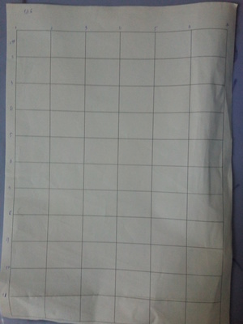

# check signature hand
 My name is Banh Phuoc Trung, im a Vietnamese-student, my major is computer science
 this project is my dissertation i share it with license **GNU GPLv3** (please do not user for commercial)
 i share it for those who are interested in writing recognition
 thank for all my friend how help me to complete the datasets 
 
### how to do it
##### 1. data collection

you will not see any picture of data because it is ==++personal property++== 
the form to collect data look like this you can create one by you self 

.
	
	
##### 2. Data processing

In dataprocess.py you can see `readImage()` function 
i use [opencv](https://opencv.org/) in this function
```python
		im = Imager()
		for img in imPaths:
			# print("read Image")
			im.cropImage(img,newPath)
		imPaths = loader(newPath)
		for img in imPaths :
			im.noneBorder(img,noneBorder)

		dataTrain = list()
		for path in loader(noneBorder):
			dataTrain.append(im.frameImage(path))
	``` 
all this code is `return` a list of image frame 
	if you dont know what is `Imager` you can read it in my code 
##### 3. Save data 

```python
		listImage = readImage()
		pickle.dump(listImage,open("../dataModel-15-66.pkl","wb"))
	```
##### 4. Create model with CNNs (Keras) 

To create model CNNs i using Keras i think i more comfortable than Tensoflow 
```python 
		model = Sequential()
		model.add(Conv2D(32,kernel_size=(5,5),strides=(1,1),activation='relu',input_shape=input_shape))
		model.add(MaxPool2D(pool_size=(2,2),strides=(2,2)))

		model.add(Conv2D(64,kernel_size=(5,5),strides=(1,1),activation='relu'))
		model.add(MaxPool2D(pool_size=(2,2),strides=(2,2)))

		model.add(Flatten())
		model.add(Dense(300,activation='relu'))
		model.add(Dense(15, activation='softmax'))

		model.compile(loss=keras.losses.categorical_crossentropy,
									optimizer=keras.optimizers.SGD(lr=0.005),
									metrics=['accuracy'])

		model.fit(xTrain, yTrain,
							batch_size=50,
							epochs=90,
							verbose=1,
							validation_data=(xTest, yTest))

		model.save("CNNmodel.h5")
``` 
read more infomation about Keras [here](https://keras.io/) 
	and  accuracy look like this 
##### 5. test Model 
i process input image like the datasets 
in test.py i replace the path in 
	`im=cv2.imread("/home/banhtrung/Code/ProcessImagePython/detectSign/test/real8.jpg")`
it view show the resutl with this code 
```python
cv2.imshow("Resulting Image with Rectangular ROIs", im)
cv2.waitKey(0)
```
	
give me a start if you like this and create issue if you have any question or have any bestter code 

all links below to research when i do this project 

https://docs.opencv.org/2.4/modules/imgproc/doc/miscellaneous_transformations.html
https://machinelearningmastery.com/handwritten-digit-recognition-using-convolutional-neural-networks-python-keras/
https://docs.opencv.org/3.4.0/d7/d4d/tutorial_py_thresholding.html
http://cs231n.github.io/convolutional-networks/
